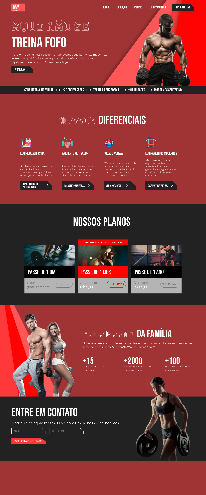

    
    
Gym Robust Habit

## About

Welcome to the official page of Robust Habit Gym! This project represents an interactive and responsive web page for a fictitious gym called "Robust Habit." Robust Habit Gym is dedicated to helping people adopt healthy lifestyle habits and achieve their fitness goals.

In this project, we developed an attractive and functional gym website using front-end technologies, including HTML, CSS, and JavaScript. With the aim of creating a user-friendly and informative interface to attract potential members, providing information about services, plans, equipment, and much more.

## Features and Resources

* HTML5
* CSS3 and SASS
* Javascript
* Jquery
* Responsive
* Media Queries e Breakpoints
* Bootstrap

# Credits

Thanks to:
* [John Ferreira](https://github.com/21Johnn)
    * Creator of the Design UI/UX

